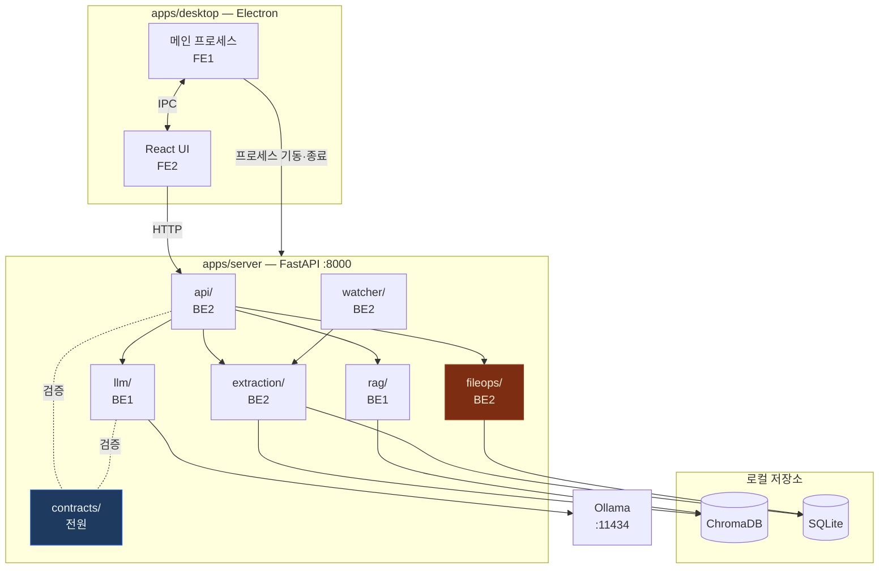

# 아키텍처

## 전체 구조

Electron 앱 하나에 React UI와 Python 서버가 들어 있습니다.
서버는 로컬호스트에만 바인딩되며 외부로 어떤 요청도 보내지 않습니다.



## 두 개의 흐름

### 1. 인덱싱

사용자가 폴더를 선택하면 시작됩니다. 이후에는 Watchdog이 변경을 감지해
**바뀐 파일만** 다시 처리합니다.

```
폴더 선택 → 파일 순회 → 텍스트 추출(PyMuPDF, 첫 페이지 1,500자)
         → 임베딩 → ChromaDB 저장
         → 메타데이터(경로·수정일·해시) → SQLite
```

해시를 비교해 내용이 그대로면 재임베딩을 건너뜁니다. 1,000개 폴더를 매번
전부 다시 도는 것과 바뀐 3개만 처리하는 것의 차이입니다.

### 2. 검색과 추천

```
자연어 쿼리 ──→ 임베딩 ──→ ChromaDB 유사도 검색 ──→ 관련 문서 상위 N건
                                                        │
정리 요청 ────→ 대상 문서 텍스트 ─────────────────────┤
                                                        ▼
                                          프롬프트 조립 (문서 + 유사 예시)
                                                        │
                                                        ▼
                                              Ollama (format: json)
                                                        │
                                                        ▼
                                          Pydantic 검증 ──실패──→ 1회 재시도
                                                        │              (제약 명시)
                                                        ▼
                                              미리보기 → 사용자 승인
                                                        │
                                                        ▼
                                          shutil 이동/이름변경 → 이력 기록
```

## 왜 유사 예시를 넣는가

같은 모델·같은 표본 30건에서 프롬프트만 바꿔 측정한 값입니다.

| 조건 | 정확도 |
|---|---|
| 카테고리 이름과 한 줄 설명만 | 20.0% |
| 폴더 정리 관례를 함께 제공 | 70.0% |

50%p 차이입니다. 모델 크기를 키우는 것보다 **이 사용자가 평소 어떻게 정리하는지**를
알려주는 쪽이 압도적으로 큽니다. `rag/`가 찾아오는 유사 예시가 그 역할을 합니다.

따라서 **검색 품질이 추천 정확도의 상한**입니다. 검색이 엉뚱한 예시를 물어오면
LLM은 그걸 근거로 엉뚱한 폴더를 제안합니다. RAG 품질 개선이 우선순위 1번인 이유입니다.

자세한 실험 조건과 선정 근거는 [ADR-0002](decisions/0002-model-selection.md).

## 프로세스 생명주기

Electron이 FastAPI를 자식 프로세스로 띄웁니다. 사용자 입장에서는 앱 하나입니다.

```
앱 시작 → server.exe spawn → /health 폴링 → 200 응답 → UI 활성화
앱 종료 → SIGTERM → (5초 내 미종료 시) 강제 종료
```

주의할 점:

- **포트 충돌** — 8000이 사용 중일 수 있습니다. 빈 포트를 잡아 렌더러에 전달하세요.
- **좀비 프로세스** — 앱이 비정상 종료되면 서버가 남습니다. 종료 처리를 반드시 넣으세요.
- **기동 지연** — 서버가 뜨기 전에 UI가 요청을 보내면 실패합니다. `/health`가 뚫릴 때까지 기다립니다.

## 안전 장치

사용자 파일을 건드리는 코드는 `fileops/` 한 곳뿐입니다.

| | |
|---|---|
| **승인 없이 실행 안 함** | 추천은 미리보기까지. 승인된 항목만 실행합니다 |
| **삭제 없음** | 이동과 이름 변경만. 삭제 기능은 MVP 범위 밖입니다 |
| **충돌 검사** | 대상 경로에 같은 이름이 있으면 실행하지 않고 보고합니다 |
| **이력 기록** | 모든 변경을 SQLite에 append-only로 남깁니다 |
| **실패해도 안 죽음** | 파일이 열려 있어 이동 불가면 해당 항목만 실패로 보고합니다 |

## 데이터가 나가지 않는다는 것

- 서버는 `127.0.0.1`에만 바인딩합니다
- 외부 API 호출이 없습니다. Ollama도 로컬 프로세스입니다
- 문서 본문과 임베딩은 사용자 PC의 ChromaDB·SQLite에만 저장됩니다
- 텔레메트리, 크래시 리포트, 사용 통계 전송이 없습니다

> ChromaDB는 기본적으로 익명 사용 통계를 전송합니다.
> `ANONYMIZED_TELEMETRY=False`로 반드시 꺼야 합니다.

## 기술 선택

| 영역 | 선택 | 이유 |
|---|---|---|
| 데스크톱 셸 | Electron | Python 프로세스를 자식으로 관리하기 쉽습니다. Tauri는 사이드카 설정이 더 까다롭습니다 |
| LLM 런타임 | Ollama | 모델 관리·양자화·JSON 강제 출력이 기본 제공됩니다 |
| LLM | `exaone3.5:7.8b` | 한국어 문서 분류 우위. VRAM 8GB 상한 안 ([ADR-0002](decisions/0002-model-selection.md)) |
| 벡터 DB | ChromaDB | 로컬 영속, 별도 서버 프로세스 불필요 |
| 메타데이터 | SQLite | 파일 하나. 설치 불필요 |
| 검증 | Pydantic | LLM 출력을 스키마로 강제. `extra="forbid"` |
| 추출 | PyMuPDF | PDF 텍스트 추출 속도가 가장 빠릅니다 |
